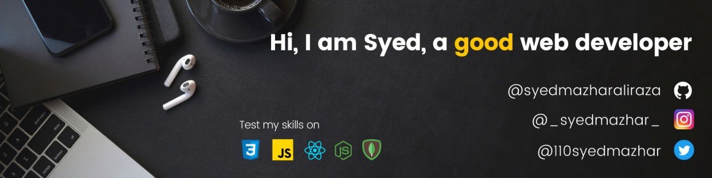

<h1 align="center">Hi 👋, I'm Syed Mazhar Ali Raza!</h1>

  

 &nbsp;
&nbsp;
&nbsp;

## About Me 🚀
🎓  I am a 20-year-old engineering sophomore pursuing BTech in Electronics and Communications.  
👨‍💻  I am passionate about web-development (full-stack) and well versed in MERN stack.  
🌱 Currently in my exploration stage, highly ambitious, always agreeing to exposure and oppurtunities, love to interact with communities and a real hard-worker for something of my interest.

## My Experiences 🙌
### **Frontend Web Developer Intern** at [StudentPeeps](https://studentpeeps.club/)  
October 2021 - March 2022  
- Rebuilding UI, introducing new pages and additional functionalities rapidly, and working the bugs out of StudentPeep's official website by dealing with complex codebase developed using Python Web framework: Django along with H/C/JavaScript & other libraries at the front end.  
- About StudentPeeps: StudentPeeps is an invite-only community where university students get exclusive student discounts from their favorite brands. The startup deals with different brands to provide such student discounts.

### **Alpha Microsoft Learn Student Ambassador** at [Microsoft](https://studentambassadors.microsoft.com/)  
October 2021 - present  
- Took my first workshop ever on how to get selected in Microsoft Learn Student Ambassador program as a fresher. I managed to conduct a successful 1:15 hour long session and was accompanied with 150+ consistent attendees.  
- I plan to take session on Git and Github, Web dev related topics, personal branding, etc. I love to serve the community, especially freshers.
- Microsoft Learn Student Ambassadors Program brings together selected students from all over the world who have the passion for technology and helping the community. It provides oppurtunities to interact with their peers, mentors, Professionals, and resources to learn various Microsoft technologies, and implement it in real world

### **Project Mentor** at [Cross Winter of Code 2021](https://crosswoc.ieeedtu.in/)  
FEBRUARY 2021 - MARCH 2021  
- Mentored students for getting started to open-source contributions, and work on the <ins>project: [IntrepidKey](https://github.com/syedmazharaliraza/IntrepidKey)</ins> based on the technology stack: HTML, CSS, JAVASCRIPT. 
- My communication and technical skills were enhanced, leadership and management qualities were developed, confidence and motivation for open-source and programming was boosted, and many more benefits were experienced throughout the mentorship.

### **Mentee** at [JGEC Winter of code 2k20](https://jwoc2k20.tech/)  
JANUARY 2021 - FEBRUARY 2021  
- Managed to get 5+ successful pull requests merged under a few projects of technology stack: HTML, CSS, JAVASCRIPT.
- Learned and enhanced skills on git, github, and my tech stack(html, css, js), increased my communication and social confidence, learned dealing with issues and developing solutions in minimum time, and experienced many more benefits.

